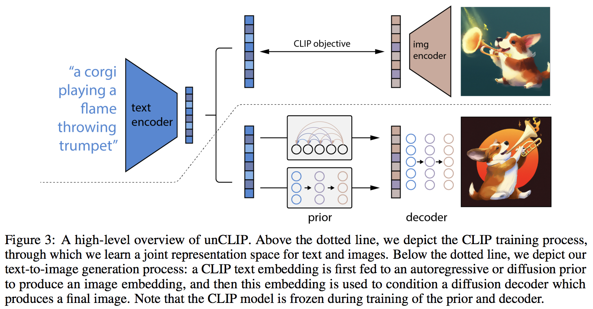
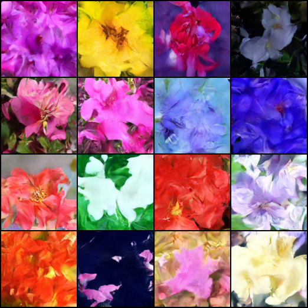

</img>

## DALL-E 2 - Pytorch

Implementation of <a href="https://openai.com/dall-e-2/">DALL-E 2</a>, OpenAI's updated text-to-image synthesis neural network, in Pytorch.

<a href="https://youtu.be/RJwPN4qNi_Y?t=555">Yannic Kilcher summary</a> | <a href="https://www.youtube.com/watch?v=F1X4fHzF4mQ">AssemblyAI explainer</a>

The main novelty seems to be an extra layer of indirection with the prior network (whether it is an autoregressive transformer or a diffusion network), which predicts an image embedding based on the text embedding from CLIP. Specifically, this repository will only build out the diffusion prior network, as it is the best performing variant (but which incidentally involves a causal transformer as the denoising network 😂)

This model is SOTA for text-to-image for now.

Please join <a href="https://discord.gg/xBPBXfcFHd"></a> if you are interested in helping out with the replication with the <a href="https://laion.ai/">LAION</a> community | <a href="https://www.youtube.com/watch?v=AIOE1l1W0Tw">Yannic Interview</a>

As of 5/23/22, it is no longer SOTA. SOTA will be <a href="https://github.com/lucidrains/imagen-pytorch">here</a>. Jax versions as well as text-to-video project will be shifted towards the Imagen architecture, as it is way simpler.

## Status

- A research group has used the code in this repository to train a functional diffusion prior for their CLIP generations. Will share their work once they release their preprint. This, and <a href="https://github.com/crowsonkb">Katherine's</a> own experiments, validate OpenAI's finding that the extra prior increases variety of generations.

- Decoder is now verified working for unconditional generation on my experimental setup for Oxford flowers. 2 researchers have also confirmed Decoder is working for them.



*ongoing at 21k steps*

- <a href="https://twitter.com/Buntworthy/status/1529475416775434240?t=0GEge3Kr9I36cjcUVCQUTg">Justin Pinkney</a> successfully trained the diffusion prior in the repository for his CLIP to Stylegan2 text-to-image application

## Pre-Trained Models
- LAION is training prior models. Checkpoints are available on <a href="https://huggingface.co/zenglishuci/conditioned-prior">🤗huggingface</a> and the training statistics are available on <a href="https://wandb.ai/nousr_laion/conditioned-prior/reports/LAION-DALLE2-PyTorch-Prior--VmlldzoyMDI2OTIx">🐝WANDB</a>.
- Decoder - <a href="https://wandb.ai/veldrovive/dalle2_train_decoder/runs/jkrtg0so?workspace=user-veldrovive">In-progress test run</a> 🚧
- DALL-E 2 🚧

## Install

```bash
$ pip install dalle2-pytorch
```

## Usage

To train DALLE-2 is a 3 step process, with the training of CLIP being the most important

To train CLIP, you can either use <a href="https://github.com/lucidrains/x-clip">x-clip</a> package, or join the LAION discord, where a lot of replication efforts are already <a href="https://github.com/mlfoundations/open_clip">underway</a>.

This repository will demonstrate integration with `x-clip` for starters

```python
import torch
from dalle2_pytorch import CLIP

clip = CLIP(
    dim_text = 512,
    dim_image = 512,
    dim_latent = 512,
    num_text_tokens = 49408,
    text_enc_depth = 1,
    text_seq_len = 256,
    text_heads = 8,
    visual_enc_depth = 1,
    visual_image_size = 256,
    visual_patch_size = 32,
    visual_heads = 8,
    use_all_token_embeds = True,            # whether to use fine-grained contrastive learning (FILIP)
    decoupled_contrastive_learning = True,  # use decoupled contrastive learning (DCL) objective function, removing positive pairs from the denominator of the InfoNCE loss (CLOOB + DCL)
    extra_latent_projection = True,         # whether to use separate projections for text-to-image vs image-to-text comparisons (CLOOB)
    use_visual_ssl = True,                  # whether to do self supervised learning on images
    visual_ssl_type = 'simclr',             # can be either 'simclr' or 'simsiam', depending on using DeCLIP or SLIP
    use_mlm = False,                        # use masked language learning (MLM) on text (DeCLIP)
    text_ssl_loss_weight = 0.05,            # weight for text MLM loss
    image_ssl_loss_weight = 0.05            # weight for image self-supervised learning loss
).cuda()

# mock data

text = torch.randint(0, 49408, (4, 256)).cuda()
images = torch.randn(4, 3, 256, 256).cuda()

# train

loss = clip(
    text,
    images,
    return_loss = True              # needs to be set to True to return contrastive loss
)

loss.backward()

# do the above with as many texts and images as possible in a loop
```

Then, you will need to train the decoder, which learns to generate images based on the image embedding coming from the trained CLIP above

```python
import torch
from dalle2_pytorch import Unet, Decoder, CLIP

# trained clip from step 1

clip = CLIP(
    dim_text = 512,
    dim_image = 512,
    dim_latent = 512,
    num_text_tokens = 49408,
    text_enc_depth = 1,
    text_seq_len = 256,
    text_heads = 8,
    visual_enc_depth = 1,
    visual_image_size = 256,
    visual_patch_size = 32,
    visual_heads = 8
).cuda()

# unet for the decoder

unet = Unet(
    dim = 128,
    image_embed_dim = 512,
    cond_dim = 128,
    channels = 3,
    dim_mults=(1, 2, 4, 8)
).cuda()

# decoder, which contains the unet and clip

decoder = Decoder(
    unet = unet,
    clip = clip,
    timesteps = 100,
    image_cond_drop_prob = 0.1,
    text_cond_drop_prob = 0.5
).cuda()

# mock images (get a lot of this)

images = torch.randn(4, 3, 256, 256).cuda()

# feed images into decoder

loss = decoder(images)
loss.backward()

# do the above for many many many many steps
# then it will learn to generate images based on the CLIP image embeddings
```

Finally, the main contribution of the paper. The repository offers the diffusion prior network. It takes the CLIP text embeddings and tries to generate the CLIP image embeddings. Again, you will need the trained CLIP from the first step

```python
import torch
from dalle2_pytorch import DiffusionPriorNetwork, DiffusionPrior, CLIP

# get trained CLIP from step one

clip = CLIP(
    dim_text = 512,
    dim_image = 512,
    dim_latent = 512,
    num_text_tokens = 49408,
    text_enc_depth = 6,
    text_seq_len = 256,
    text_heads = 8,
    visual_enc_depth = 6,
    visual_image_size = 256,
    visual_patch_size = 32,
    visual_heads = 8,
).cuda()

# setup prior network, which contains an autoregressive transformer

prior_network = DiffusionPriorNetwork(
    dim = 512,
    depth = 6,
    dim_head = 64,
    heads = 8
).cuda()

# diffusion prior network, which contains the CLIP and network (with transformer) above

diffusion_prior = DiffusionPrior(
    net = prior_network,
    clip = clip,
    timesteps = 100,
    cond_drop_prob = 0.2
).cuda()

# mock data

text = torch.randint(0, 49408, (4, 256)).cuda()
images = torch.randn(4, 3, 256, 256).cuda()

# feed text and images into diffusion prior network

loss = diffusion_prior(text, images)
loss.backward()

# do the above for many many many steps
# now the diffusion prior can generate image embeddings from the text embeddings
```

In the paper, they actually used a <a href="https://cascaded-diffusion.github.io/">recently discovered technique</a>, from <a href="http://www.jonathanho.me/">Jonathan Ho</a> himself (original author of DDPMs, the core technique used in DALL-E v2) for high resolution image synthesis.

This can easily be used within this framework as so

```python
import torch
from dalle2_pytorch import Unet, Decoder, CLIP

# trained clip from step 1

clip = CLIP(
    dim_text = 512,
    dim_image = 512,
    dim_latent = 512,
    num_text_tokens = 49408,
    text_enc_depth = 6,
    text_seq_len = 256,
    text_heads = 8,
    visual_enc_depth = 6,
    visual_image_size = 256,
    visual_patch_size = 32,
    visual_heads = 8
).cuda()

# 2 unets for the decoder (a la cascading DDPM)

unet1 = Unet(
    dim = 32,
    image_embed_dim = 512,
    cond_dim = 128,
    channels = 3,
    dim_mults = (1, 2, 4, 8)
).cuda()

unet2 = Unet(
    dim = 32,
    image_embed_dim = 512,
    cond_dim = 128,
    channels = 3,
    dim_mults = (1, 2, 4, 8, 16)
).cuda()

# decoder, which contains the unet(s) and clip

decoder = Decoder(
    clip = clip,
    unet = (unet1, unet2),            # insert both unets in order of low resolution to highest resolution (you can have as many stages as you want here)
    image_sizes = (256, 512),         # resolutions, 256 for first unet, 512 for second. these must be unique and in ascending order (matches with the unets passed in)
    timesteps = 1000,
    image_cond_drop_prob = 0.1,
    text_cond_drop_prob = 0.5
).cuda()

# mock images (get a lot of this)

images = torch.randn(4, 3, 512, 512).cuda()

# feed images into decoder, specifying which unet you want to train
# each unet can be trained separately, which is one of the benefits of the cascading DDPM scheme

loss = decoder(images, unet_number = 1)
loss.backward()

loss = decoder(images, unet_number = 2)
loss.backward()

# do the above for many steps for both unets
```

Finally, to generate the DALL-E2 images from text. Insert the trained `DiffusionPrior` as well as the `Decoder` (which wraps `CLIP`, the causal transformer, and unet(s))

```python
from dalle2_pytorch import DALLE2

dalle2 = DALLE2(
    prior = diffusion_prior,
    decoder = decoder
)

# send the text as a string if you want to use the simple tokenizer from DALLE v1
# or you can do it as token ids, if you have your own tokenizer

texts = ['glistening morning dew on a flower petal']
images = dalle2(texts) # (1, 3, 256, 256)
```

That's it!

Let's see the whole script below

```python
import torch
from dalle2_pytorch import DALLE2, DiffusionPriorNetwork, DiffusionPrior, Unet, Decoder, CLIP

clip = CLIP(
    dim_text = 512,
    dim_image = 512,
    dim_latent = 512,
    num_text_tokens = 49408,
    text_enc_depth = 6,
    text_seq_len = 256,
    text_heads = 8,
    visual_enc_depth = 6,
    visual_image_size = 256,
    visual_patch_size = 32,
    visual_heads = 8
).cuda()

# mock data

text = torch.randint(0, 49408, (4, 256)).cuda()
images = torch.randn(4, 3, 256, 256).cuda()

# train

loss = clip(
    text,
    images,
    return_loss = True
)

loss.backward()

# do above for many steps ...

# prior networks (with transformer)

prior_network = DiffusionPriorNetwork(
    dim = 512,
    depth = 6,
    dim_head = 64,
    heads = 8
).cuda()

diffusion_prior = DiffusionPrior(
    net = prior_network,
    clip = clip,
    timesteps = 100,
    cond_drop_prob = 0.2
).cuda()

loss = diffusion_prior(text, images)
loss.backward()

# do above for many steps ...

# decoder (with unet)

unet1 = Unet(
    dim = 128,
    image_embed_dim = 512,
    cond_dim = 128,
    channels = 3,
    dim_mults=(1, 2, 4, 8)
).cuda()

unet2 = Unet(
    dim = 16,
    image_embed_dim = 512,
    cond_dim = 128,
    channels = 3,
    dim_mults = (1, 2, 4, 8, 16)
).cuda()

decoder = Decoder(
    unet = (unet1, unet2),
    image_sizes = (128, 256),
    clip = clip,
    timesteps = 100,
    image_cond_drop_prob = 0.1,
    text_cond_drop_prob = 0.5,
    condition_on_text_encodings = False  # set this to True if you wish to condition on text during training and sampling
).cuda()

for unet_number in (1, 2):
    loss = decoder(images, unet_number = unet_number) # this can optionally be decoder(images, text) if you wish to condition on the text encodings as well, though it was hinted in the paper it didn't do much
    loss.backward()

# do above for many steps

dalle2 = DALLE2(
    prior = diffusion_prior,
    decoder = decoder
)

images = dalle2(
    ['cute puppy chasing after a squirrel'],
    cond_scale = 2. # classifier free guidance strength (> 1 would strengthen the condition)
)

# save your image (in this example, of size 256x256)
```

Everything in this readme should run without error

You can also train the decoder on images of greater than the size (say 512x512) at which CLIP was trained (256x256). The images will be resized to CLIP image resolution for the image embeddings

For the layperson, no worries, training will all be automated into a CLI tool, at least for small scale training.

## Training on Preprocessed CLIP Embeddings

It is likely, when scaling up, that you would first preprocess your images and text into corresponding embeddings before training the prior network. You can do so easily by simply passing in `image_embed`, `text_embed`, and optionally `text_encodings` and `text_mask`

Working example below

```python
import torch
from dalle2_pytorch import DiffusionPriorNetwork, DiffusionPrior, CLIP

# get trained CLIP from step one

clip = CLIP(
    dim_text = 512,
    dim_image = 512,
    dim_latent = 512,
    num_text_tokens = 49408,
    text_enc_depth = 6,
    text_seq_len = 256,
    text_heads = 8,
    visual_enc_depth = 6,
    visual_image_size = 256,
    visual_patch_size = 32,
    visual_heads = 8,
).cuda()

# setup prior network, which contains an autoregressive transformer

prior_network = DiffusionPriorNetwork(
    dim = 512,
    depth = 6,
    dim_head = 64,
    heads = 8
).cuda()

# diffusion prior network, which contains the CLIP and network (with transformer) above

diffusion_prior = DiffusionPrior(
    net = prior_network,
    clip = clip,
    timesteps = 100,
    cond_drop_prob = 0.2,
    condition_on_text_encodings = False  # this probably should be true, but just to get Laion started
).cuda()

# mock data

text = torch.randint(0, 49408, (4, 256)).cuda()
images = torch.randn(4, 3, 256, 256).cuda()

# precompute the text and image embeddings
# here using the diffusion prior class, but could be done with CLIP alone

clip_image_embeds = diffusion_prior.clip.embed_image(images).image_embed
clip_text_embeds = diffusion_prior.clip.embed_text(text).text_embed

# feed text and images into diffusion prior network

loss = diffusion_prior(
    text_embed = clip_text_embeds,
    image_embed = clip_image_embeds
)

loss.backward()

# do the above for many many many steps
# now the diffusion prior can generate image embeddings from the text embeddings
```

You can also completely go `CLIP`-less, in which case you will need to pass in the `image_embed_dim` into the `DiffusionPrior` on initialization

```python
import torch
from dalle2_pytorch import DiffusionPriorNetwork, DiffusionPrior

# setup prior network, which contains an autoregressive transformer

prior_network = DiffusionPriorNetwork(
    dim = 512,
    depth = 6,
    dim_head = 64,
    heads = 8
).cuda()

# diffusion prior network, which contains the CLIP and network (with transformer) above

diffusion_prior = DiffusionPrior(
    net = prior_network,
    image_embed_dim = 512,               # this needs to be set
    timesteps = 100,
    cond_drop_prob = 0.2,
    condition_on_text_encodings = False  # this probably should be true, but just to get Laion started
).cuda()

# mock data

text = torch.randint(0, 49408, (4, 256)).cuda()
images = torch.randn(4, 3, 256, 256).cuda()

# precompute the text and image embeddings
# here using the diffusion prior class, but could be done with CLIP alone

clip_image_embeds = torch.randn(4, 512).cuda()
clip_text_embeds = torch.randn(4, 512).cuda()

# feed text and images into diffusion prior network

loss = diffusion_prior(
    text_embed = clip_text_embeds,
    image_embed = clip_image_embeds
)

loss.backward()

# do the above for many many many steps
# now the diffusion prior can generate image embeddings from the text embeddings
```

## OpenAI CLIP

Although there is the possibility they are using an unreleased, more powerful CLIP, you can use one of the released ones, if you do not wish to train your own CLIP from scratch. This will also allow the community to more quickly validate the conclusions of the paper.

To use a pretrained OpenAI CLIP, simply import `OpenAIClipAdapter` and pass it into the `DiffusionPrior` or `Decoder` like so

```python
import torch
from dalle2_pytorch import DALLE2, DiffusionPriorNetwork, DiffusionPrior, Unet, Decoder, OpenAIClipAdapter

# openai pretrained clip - defaults to ViT-B/32

clip = OpenAIClipAdapter()

# mock data

text = torch.randint(0, 49408, (4, 256)).cuda()
images = torch.randn(4, 3, 256, 256).cuda()

# prior networks (with transformer)

prior_network = DiffusionPriorNetwork(
    dim = 512,
    depth = 6,
    dim_head = 64,
    heads = 8
).cuda()

diffusion_prior = DiffusionPrior(
    net = prior_network,
    clip = clip,
    timesteps = 100,
    cond_drop_prob = 0.2
).cuda()

loss = diffusion_prior(text, images)
loss.backward()

# do above for many steps ...

# decoder (with unet)

unet1 = Unet(
    dim = 128,
    image_embed_dim = 512,
    cond_dim = 128,
    channels = 3,
    dim_mults=(1, 2, 4, 8)
).cuda()

unet2 = Unet(
    dim = 16,
    image_embed_dim = 512,
    cond_dim = 128,
    channels = 3,
    dim_mults = (1, 2, 4, 8, 16)
).cuda()

decoder = Decoder(
    unet = (unet1, unet2),
    image_sizes = (128, 256),
    clip = clip,
    timesteps = 100,
    image_cond_drop_prob = 0.1,
    text_cond_drop_prob = 0.5,
    condition_on_text_encodings = False  # set this to True if you wish to condition on text during training and sampling
).cuda()

for unet_number in (1, 2):
    loss = decoder(images, unet_number = unet_number) # this can optionally be decoder(images, text) if you wish to condition on the text encodings as well, though it was hinted in the paper it didn't do much
    loss.backward()

# do above for many steps

dalle2 = DALLE2(
    prior = diffusion_prior,
    decoder = decoder
)

images = dalle2(
    ['a butterfly trying to escape a tornado'],
    cond_scale = 2. # classifier free guidance strength (> 1 would strengthen the condition)
)

# save your image (in this example, of size 256x256)
```

Now you'll just have to worry about training the Prior and the Decoder!

## Experimental

### DALL-E2 with Latent Diffusion

This repository decides to take the next step and offer DALL-E v2 combined with <a href="https://huggingface.co/spaces/multimodalart/latentdiffusion">latent diffusion</a>, from Rombach et al.

You can use it as follows. Latent diffusion can be limited to just the first U-Net in the cascade, or to any number you wish.

The repository also comes equipped with all the necessary settings to recreate `ViT-VQGan` from the <a href="https://arxiv.org/abs/2110.04627">Improved VQGans</a> paper. Furthermore, the <a href="https://github.com/lucidrains/vector-quantize-pytorch">vector quantization</a> library also comes equipped to do <a href="https://arxiv.org/abs/2203.01941">residual or multi-headed quantization</a>, which I believe will give an even further boost in performance to the autoencoder.

```python
import torch
from dalle2_pytorch import Unet, Decoder, CLIP, VQGanVAE

# trained clip from step 1

clip = CLIP(
    dim_text = 512,
    dim_image = 512,
    dim_latent = 512,
    num_text_tokens = 49408,
    text_enc_depth = 1,
    text_seq_len = 256,
    text_heads = 8,
    visual_enc_depth = 1,
    visual_image_size = 256,
    visual_patch_size = 32,
    visual_heads = 8
)

# 3 unets for the decoder (a la cascading DDPM)

# first two unets are doing latent diffusion
# vqgan-vae must be trained beforehand

vae1 = VQGanVAE(
    dim = 32,
    image_size = 256,
    layers = 3,
    layer_mults = (1, 2, 4)
)

vae2 = VQGanVAE(
    dim = 32,
    image_size = 512,
    layers = 3,
    layer_mults = (1, 2, 4)
)

unet1 = Unet(
    dim = 32,
    image_embed_dim = 512,
    cond_dim = 128,
    channels = 3,
    sparse_attn = True,
    sparse_attn_window = 2,
    dim_mults = (1, 2, 4, 8)
)

unet2 = Unet(
    dim = 32,
    image_embed_dim = 512,
    channels = 3,
    dim_mults = (1, 2, 4, 8, 16),
    cond_on_image_embeds = True,
    cond_on_text_encodings = False
)

unet3 = Unet(
    dim = 32,
    image_embed_dim = 512,
    channels = 3,
    dim_mults = (1, 2, 4, 8, 16),
    cond_on_image_embeds = True,
    cond_on_text_encodings = False,
    attend_at_middle = False
)

# decoder, which contains the unet(s) and clip

decoder = Decoder(
    clip = clip,
    vae = (vae1, vae2),                # latent diffusion for unet1 (vae1) and unet2 (vae2), but not for the last unet3
    unet = (unet1, unet2, unet3),      # insert unets in order of low resolution to highest resolution (you can have as many stages as you want here)
    image_sizes = (256, 512, 1024),    # resolutions, 256 for first unet, 512 for second, 1024 for third
    timesteps = 100,
    image_cond_drop_prob = 0.1,
    text_cond_drop_prob = 0.5
).cuda()

# mock images (get a lot of this)

images = torch.randn(1, 3, 1024, 1024).cuda()

# feed images into decoder, specifying which unet you want to train
# each unet can be trained separately, which is one of the benefits of the cascading DDPM scheme

with decoder.one_unet_in_gpu(1):
    loss = decoder(images, unet_number = 1)
    loss.backward()

with decoder.one_unet_in_gpu(2):
    loss = decoder(images, unet_number = 2)
    loss.backward()

with decoder.one_unet_in_gpu(3):
    loss = decoder(images, unet_number = 3)
    loss.backward()

# do the above for many steps for both unets

# then it will learn to generate images based on the CLIP image embeddings

# chaining the unets from lowest resolution to highest resolution (thus cascading)

mock_image_embed = torch.randn(1, 512).cuda()
images = decoder.sample(mock_image_embed) # (1, 3, 1024, 1024)
```

## Training wrapper

### Decoder Training

Training the `Decoder` may be confusing, as one needs to keep track of an optimizer for each of the `Unet`(s) separately. Each `Unet` will also need its own corresponding exponential moving average. The `DecoderTrainer` hopes to make this simple, as shown below

```python
import torch
from dalle2_pytorch import DALLE2, Unet, Decoder, CLIP, DecoderTrainer

clip = CLIP(
    dim_text = 512,
    dim_image = 512,
    dim_latent = 512,
    num_text_tokens = 49408,
    text_enc_depth = 6,
    text_seq_len = 256,
    text_heads = 8,
    visual_enc_depth = 6,
    visual_image_size = 256,
    visual_patch_size = 32,
    visual_heads = 8
).cuda()

# mock data

text = torch.randint(0, 49408, (32, 256)).cuda()
images = torch.randn(32, 3, 256, 256).cuda()

# decoder (with unet)

unet1 = Unet(
    dim = 128,
    image_embed_dim = 512,
    text_embed_dim = 512,
    cond_dim = 128,
    channels = 3,
    dim_mults=(1, 2, 4, 8)
).cuda()

unet2 = Unet(
    dim = 16,
    image_embed_dim = 512,
    text_embed_dim = 512,
    cond_dim = 128,
    channels = 3,
    dim_mults = (1, 2, 4, 8, 16),
    cond_on_text_encodings = True
).cuda()

decoder = Decoder(
    unet = (unet1, unet2),
    image_sizes = (128, 256),
    clip = clip,
    timesteps = 1000,
    condition_on_text_encodings = True
).cuda()

decoder_trainer = DecoderTrainer(
    decoder,
    lr = 3e-4,
    wd = 1e-2,
    ema_beta = 0.99,
    ema_update_after_step = 1000,
    ema_update_every = 10,
)

for unet_number in (1, 2):
    loss = decoder_trainer(
        images,
        text = text,
        unet_number = unet_number, # which unet to train on
        max_batch_size = 4         # gradient accumulation - this sets the maximum batch size in which to do forward and backwards pass - for this example 32 / 4 == 8 times
    )

    decoder_trainer.update(unet_number) # update the specific unet as well as its exponential moving average

# after much training
# you can sample from the exponentially moving averaged unets as so

mock_image_embed = torch.randn(4, 512).cuda()
images = decoder_trainer.sample(mock_image_embed, text = text) # (4, 3, 256, 256)
```

### Diffusion Prior Training

Similarly, one can use the `DiffusionPriorTrainer` to automatically instantiate and keep track of an exponential moving averaged prior.

```python
import torch
from dalle2_pytorch import DALLE2, DiffusionPriorNetwork, DiffusionPrior, DiffusionPriorTrainer, Unet, Decoder, CLIP

clip = CLIP(
    dim_text = 512,
    dim_image = 512,
    dim_latent = 512,
    num_text_tokens = 49408,
    text_enc_depth = 6,
    text_seq_len = 256,
    text_heads = 8,
    visual_enc_depth = 6,
    visual_image_size = 256,
    visual_patch_size = 32,
    visual_heads = 8
).cuda()

# mock data

text = torch.randint(0, 49408, (512, 256)).cuda()
images = torch.randn(512, 3, 256, 256).cuda()

# prior networks (with transformer)

prior_network = DiffusionPriorNetwork(
    dim = 512,
    depth = 6,
    dim_head = 64,
    heads = 8
).cuda()

diffusion_prior = DiffusionPrior(
    net = prior_network,
    clip = clip,
    timesteps = 100,
    cond_drop_prob = 0.2
).cuda()

diffusion_prior_trainer = DiffusionPriorTrainer(
    diffusion_prior,
    lr = 3e-4,
    wd = 1e-2,
    ema_beta = 0.99,
    ema_update_after_step = 1000,
    ema_update_every = 10,
)

loss = diffusion_prior_trainer(text, images, max_batch_size = 4)
diffusion_prior_trainer.update()  # this will update the optimizer as well as the exponential moving averaged diffusion prior

# after much of the above three lines in a loop
# you can sample from the exponential moving average of the diffusion prior identically to how you do so for DiffusionPrior

image_embeds = diffusion_prior_trainer.sample(text, max_batch_size = 4) # (512, 512) - exponential moving averaged image embeddings
```

## Bonus

### Unconditional Training

The repository also contains the means to train unconditional DDPM model, or even cascading DDPMs. You simply have to set `unconditional = True` in the `Decoder`

ex.

```python
import torch
from dalle2_pytorch import Unet, Decoder, DecoderTrainer

# unet for the cascading ddpm

unet1 = Unet(
    dim = 128,
    dim_mults=(1, 2, 4, 8)
).cuda()

unet2 = Unet(
    dim = 32,
    dim_mults = (1, 2, 4, 8, 16)
).cuda()

# decoder, which contains the unets

decoder = Decoder(
    unet = (unet1, unet2),
    image_sizes = (256, 512),  # first unet up to 256px, then second to 512px
    timesteps = 1000,
    unconditional = True
).cuda()

# decoder trainer

decoder_trainer = DecoderTrainer(decoder)

# images (get a lot of this)

images = torch.randn(1, 3, 512, 512).cuda()

# feed images into decoder

for i in (1, 2):
    loss = decoder_trainer(images, unet_number = i)
    decoder_trainer.update(unet_number = i)

# do the above for many many many many images
# then it will learn to generate images

images = decoder_trainer.sample(batch_size = 36, max_batch_size = 4) # (36, 3, 512, 512)
```

## Dataloaders

### Decoder Dataloaders

In order to make loading data simple and efficient, we include some general dataloaders that can be used to train portions of the network.

#### Decoder: Image Embedding Dataset

When training the decoder (and up samplers if training together) in isolation, you will need to load images and corresponding image embeddings. This dataset can read two similar types of datasets. First, it can read a [webdataset](https://github.com/webdataset/webdataset) that contains `.jpg` and `.npy` files in the `.tar`s that contain the images and associated image embeddings respectively. Alternatively, you can also specify a source for the embeddings outside of the webdataset. In this case, the path to the embeddings should contain `.npy` files with the same shard numbers as the webdataset and there should be a correspondence between the filename of the `.jpg` and the index of the embedding in the `.npy`. So, for example, `0001.tar` from the webdataset with image `00010509.jpg` (the first 4 digits are the shard number and the last 4 are the index) in it should be paralleled by a `img_emb_0001.npy` which contains a NumPy array with the embedding at index 509.

Generating a dataset of this type: 
1. Use [img2dataset](https://github.com/rom1504/img2dataset) to generate a webdataset.
2. Use [clip-retrieval](https://github.com/rom1504/clip-retrieval) to convert the images to embeddings.
3. Use [embedding-dataset-reordering](https://github.com/Veldrovive/embedding-dataset-reordering) to reorder the embeddings into the expected format.

Usage:

```python
from dalle2_pytorch.dataloaders import ImageEmbeddingDataset, create_image_embedding_dataloader

# Create a dataloader directly.
dataloader = create_image_embedding_dataloader(
    tar_url="/path/or/url/to/webdataset/{0000..9999}.tar", # Uses bracket expanding notation. This specifies to read all tars from 0000.tar to 9999.tar
    embeddings_url="path/or/url/to/embeddings/folder",     # Included if .npy files are not in webdataset. Left out or set to None otherwise
    num_workers=4,
    batch_size=32,
    shard_width=4,                                         # If a file in the webdataset shard 3 is named 0003039.jpg, we know the shard width is 4 and the last three digits are the index
    shuffle_num=200,                                       # Does a shuffle of the data with a buffer size of 200
    shuffle_shards=True,                                   # Shuffle the order the shards are read in
    resample_shards=False,                                 # Sample shards with replacement. If true, an epoch will be infinite unless stopped manually
)
for img, emb in dataloader:
    print(img.shape)  # torch.Size([32, 3, 256, 256])
    print(emb.shape)  # torch.Size([32, 512])
    # Train decoder only as shown above

# Or create a dataset without a loader so you can configure it manually
dataset = ImageEmbeddingDataset(
    urls="/path/or/url/to/webdataset/{0000..9999}.tar",
    embedding_folder_url="path/or/url/to/embeddings/folder",
    shard_width=4,
    shuffle_shards=True,
    resample=False
)
```

### Scripts (wip)

#### `train_diffusion_prior.py`

This script allows training the DiffusionPrior on pre-computed text and image embeddings. The working example below elucidates this process.
Please note that the script internally passes text_embed and image_embed to the DiffusionPrior, unlike the example below.

#### Usage

```bash
$ python train_diffusion_prior.py
```

The most significant parameters for the script are as follows:

- `image-embed-url`, default = `"https://mystic.the-eye.eu/public/AI/cah/laion5b/embeddings/laion2B-en/img_emb/"`

- `text-embed-url`, default = `"https://mystic.the-eye.eu/public/AI/cah/laion5b/embeddings/laion2B-en/text_emb/"`

- `image-embed-dim`, default = `768` - 768 corresponds to the ViT iL/14 embedding size,change it to what your chosen ViT generates

- `learning-rate`, default = `1.1e-4`

- `weight-decay`,  default = `6.02e-2`

- `max-grad-norm`, default = `0.5`

- `batch-size`, default = `10 ** 4`

- `num-epochs`, default = `5`

- `clip`, default = `None` # Signals the prior to use pre-computed embeddings

#### Loading and Saving the DiffusionPrior model

Two methods are provided, load_diffusion_model and save_diffusion_model, the names being self-explanatory. 

```python
from dalle2_pytorch.train import load_diffusion_model, save_diffusion_model
```

##### Loading

    load_diffusion_model(dprior_path, device) 
        dprior_path : path to saved model(.pth)
        device      : the cuda device you're running on
    
##### Saving

    save_diffusion_model(save_path, model, optimizer, scaler, config, image_embed_dim)
        save_path : path to save at
        model     : object of Diffusion_Prior
        optimizer : optimizer object - see train_diffusion_prior.py for how to create one. 
            e.g: optimizer = get_optimizer(diffusion_prior.net.parameters(), wd=weight_decay, lr=learning_rate)
        scaler    : a GradScaler object.
            e.g: scaler = GradScaler(enabled=amp)
        config    : config object created in train_diffusion_prior.py - see file for example. 
        image_embed_dim - the dimension of the image_embedding
            e.g: 768

## CLI (wip)

```bash
$ dream 'sharing a sunset at the summit of mount everest with my dog'
```

Once built, images will be saved to the same directory the command is invoked

<a href="https://github.com/lucidrains/big-sleep">template</a>

## Training CLI (wip)

<a href="https://github.com/lucidrains/stylegan2-pytorch">template</a>

## Appreciation

This library would not have gotten to this working state without the help of

- <a href="https://github.com/nousr">Zion</a> and <a href="https://github.com/krish240574">Kumar</a> for the diffusion training script
- <a href="https://github.com/Veldrovive">Aidan</a> for the decoder training script and dataloaders
- <a href="https://github.com/rom1504">Romain</a> for the pull request reviews and project management
- <a href="https://github.com/Ciaohe">He Cao</a> and <a href="https://github.com/xiankgx">xiankgx</a> for the Q&A and for identifying of critical bugs
- <a href="https://github.com/crowsonkb">Katherine</a> for her advice
- <a href="https://stability.ai/">Stability AI</a> for the generous sponsorship

... and many others. Thank you! 🙏

## Todo

- [x] finish off gaussian diffusion class for latent embedding - allow for prediction of epsilon
- [x] add what was proposed in the paper, where DDPM objective for image latent embedding predicts x0 directly (reread vq-diffusion paper and get caught up on that line of work)
- [x] make sure it works end to end to produce an output tensor, taking a single gradient step
- [x] augment unet so that it can also be conditioned on text encodings (although in paper they hinted this didn't make much a difference)
- [x] figure out all the current bag of tricks needed to make DDPMs great (starting with the blur trick mentioned in paper)
- [x] build the cascading ddpm by having Decoder class manage multiple unets at different resolutions
- [x] add efficient attention in unet
- [x] be able to finely customize what to condition on (text, image embed) for specific unet in the cascade (super resolution ddpms near the end may not need too much conditioning)
- [x] offload unets not being trained on to CPU for memory efficiency (for training each resolution unets separately)
- [x] build out latent diffusion architecture, with the vq-reg variant (vqgan-vae), make it completely optional and compatible with cascading ddpms
- [x] for decoder, allow ability to customize objective (predict epsilon vs x0), in case latent diffusion does better with prediction of x0
- [x] use attention-based upsampling https://arxiv.org/abs/2112.11435
- [x] use inheritance just this once for sharing logic between decoder and prior network ddpms
- [x] bring in vit-vqgan https://arxiv.org/abs/2110.04627 for the latent diffusion
- [x] abstract interface for CLIP adapter class, so other CLIPs can be brought in
- [x] take care of mixed precision as well as gradient accumulation within decoder trainer
- [x] just take care of the training for the decoder in a wrapper class, as each unet in the cascade will need its own optimizer
- [x] bring in tools to train vqgan-vae
- [x] add convnext backbone for vqgan-vae (in addition to vit [vit-vqgan] + resnet)
- [x] make sure DDPMs can be run with traditional resnet blocks (but leave convnext as an option for experimentation)
- [x] make sure for the latter unets in the cascade, one can train on crops for learning super resolution (constrain the unet to be only convolutions in that case, or allow conv-like attention with rel pos bias)
- [x] offer setting in diffusion prior to split time and image embeddings into multiple tokens, configurable, for more surface area during attention
- [x] make sure resnet hyperparameters can be configurable across unet depth (groups and expansion factor)
- [x] pull logic for training diffusion prior into a class DiffusionPriorTrainer, for eventual script based + CLI based training
- [x] make sure the cascading ddpm in the repository can be trained unconditionally, offer a one-line CLI tool for training on a folder of images
- [x] bring in cross-scale embedding from iclr paper https://github.com/lucidrains/vit-pytorch/blob/main/vit_pytorch/crossformer.py#L14
- [x] cross embed layers for downsampling, as an option
- [x] use an experimental tracker agnostic setup, as done <a href="https://github.com/lucidrains/tf-bind-transformer#simple-trainer-class-for-fine-tuning">here</a>
- [x] use pydantic for config drive training
- [x] for both diffusion prior and decoder, all exponential moving averaged models needs to be saved and restored as well (as well as the step number)
- [x] offer save / load methods on the trainer classes to automatically take care of state dicts for scalers / optimizers / saving versions and checking for breaking changes
- [x] allow for creation of diffusion prior model off pydantic config classes - consider the same for tracker configs
- [ ] become an expert with unets, cleanup unet code, make it fully configurable, port all learnings over to https://github.com/lucidrains/x-unet (test out unet² in ddpm repo) - consider https://github.com/lucidrains/uformer-pytorch attention-based unet
- [ ] transcribe code to Jax, which lowers the activation energy for distributed training, given access to TPUs
- [ ] train on a toy task, offer in colab
- [ ] think about how best to design a declarative training config that handles preencoding for prior and training of multiple networks in decoder
- [ ] extend diffusion head to use diffusion-gan (potentially using lightweight-gan) to speed up inference
- [ ] figure out if possible to augment with external memory, as described in https://arxiv.org/abs/2204.11824
- [ ] test out grid attention in cascading ddpm locally, decide whether to keep or remove https://arxiv.org/abs/2204.01697
- [ ] interface out the vqgan-vae so a pretrained one can be pulled off the shelf to validate latent diffusion + DALL-E2
- [ ] make sure FILIP works with DALL-E2 from x-clip https://arxiv.org/abs/2111.07783
- [ ] bring in skip-layer excitations (from lightweight gan paper) to see if it helps for either decoder of unet or vqgan-vae training
- [ ] decoder needs one day worth of refactor for tech debt
- [ ] allow for unet to be able to condition non-cross attention style as well
- [ ] read the paper, figure it out, and build it https://github.com/lucidrains/DALLE2-pytorch/issues/89

## Citations

```bibtex
@misc{ramesh2022,
    title   = {Hierarchical Text-Conditional Image Generation with CLIP Latents}, 
    author  = {Aditya Ramesh et al},
    year    = {2022}
}
```

```bibtex
@misc{crowson2022,
    author  = {Katherine Crowson},
    url     = {https://twitter.com/rivershavewings}
}
```

```bibtex
@misc{rombach2021highresolution,
    title   = {High-Resolution Image Synthesis with Latent Diffusion Models}, 
    author  = {Robin Rombach and Andreas Blattmann and Dominik Lorenz and Patrick Esser and Björn Ommer},
    year    = {2021},
    eprint  = {2112.10752},
    archivePrefix = {arXiv},
    primaryClass = {cs.CV}
}
```

```bibtex
@article{shen2019efficient,
    author  = {Zhuoran Shen and Mingyuan Zhang and Haiyu Zhao and Shuai Yi and Hongsheng Li},
    title   = {Efficient Attention: Attention with Linear Complexities},
    journal = {CoRR},
    year    = {2018},
    url     = {http://arxiv.org/abs/1812.01243},
}
```

```bibtex
@inproceedings{Tu2022MaxViTMV,
    title   = {MaxViT: Multi-Axis Vision Transformer},
    author  = {Zhengzhong Tu and Hossein Talebi and Han Zhang and Feng Yang and Peyman Milanfar and Alan Conrad Bovik and Yinxiao Li},
    year    = {2022},
    url     = {https://arxiv.org/abs/2204.01697}
}
```

```bibtex
@article{Yu2021VectorquantizedIM,
    title   = {Vector-quantized Image Modeling with Improved VQGAN},
    author  = {Jiahui Yu and Xin Li and Jing Yu Koh and Han Zhang and Ruoming Pang and James Qin and Alexander Ku and Yuanzhong Xu and Jason Baldridge and Yonghui Wu},
    journal = {ArXiv},
    year    = {2021},
    volume  = {abs/2110.04627}
}
```

```bibtex
@article{Shleifer2021NormFormerIT,
    title   = {NormFormer: Improved Transformer Pretraining with Extra Normalization},
    author  = {Sam Shleifer and Jason Weston and Myle Ott},
    journal = {ArXiv},
    year    = {2021},
    volume  = {abs/2110.09456}
}
```

```bibtex
@article{Yu2022CoCaCC,
    title   = {CoCa: Contrastive Captioners are Image-Text Foundation Models},
    author  = {Jiahui Yu and Zirui Wang and Vijay Vasudevan and Legg Yeung and Mojtaba Seyedhosseini and Yonghui Wu},
    journal = {ArXiv},
    year    = {2022},
    volume  = {abs/2205.01917}
}
```

```bibtex
@misc{wang2021crossformer,
    title   = {CrossFormer: A Versatile Vision Transformer Hinging on Cross-scale Attention},
    author  = {Wenxiao Wang and Lu Yao and Long Chen and Binbin Lin and Deng Cai and Xiaofei He and Wei Liu},
    year    = {2021},
    eprint  = {2108.00154},
    archivePrefix = {arXiv},
    primaryClass = {cs.CV}
}
```

```bibtex
@article{ho2021cascaded,
    title   = {Cascaded Diffusion Models for High Fidelity Image Generation},
    author  = {Ho, Jonathan and Saharia, Chitwan and Chan, William and Fleet, David J and Norouzi, Mohammad and Salimans, Tim},
    journal = {arXiv preprint arXiv:2106.15282},
    year    = {2021}
}
```

```bibtex
@misc{Saharia2022,
    title   = {Imagen: unprecedented photorealism × deep level of language understanding},
    author  = {Chitwan Saharia*, William Chan*, Saurabh Saxena†, Lala Li†, Jay Whang†, Emily Denton, Seyed Kamyar Seyed Ghasemipour, Burcu Karagol Ayan, S. Sara Mahdavi, Rapha Gontijo Lopes, Tim Salimans, Jonathan Ho†, David Fleet†, Mohammad Norouzi*},
    year    = {2022}
}
```

*Creating noise from data is easy; creating data from noise is generative modeling.* - <a href="https://arxiv.org/abs/2011.13456">Yang Song's paper</a>
